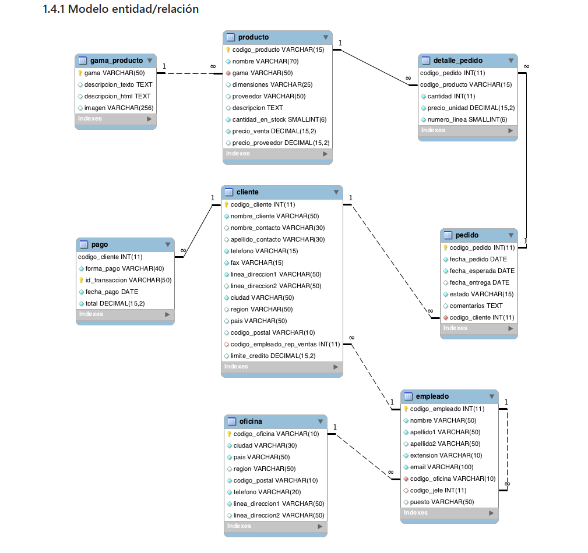

# Proyecto SQL - Sistema de Gestión Comercial

Repositorio orientado a la práctica y resolución de consultas SQL sobre una base de datos relacional de gestión comercial.

Las consultas desarrolladas permiten obtener información relacionada con ventas, facturación, clientes, productos, pagos, stock y relaciones entre entidades de la base de datos.

El proyecto fue desarrollado utilizando SQL Server Management Studio (SSMS) e incluye consultas de distintos niveles de complejidad, abarcando desde operaciones básicas hasta subconsultas y consultas analíticas.

---

## Objetivos del proyecto

- Fortalecer el manejo de SQL aplicado a bases de datos relacionales
- Trabajar con relaciones entre múltiples tablas
- Desarrollar lógica de consulta y análisis de datos
- Comprender la relación entre entidades dentro de una base de datos
---

## Tecnologías utilizadas

- SQL Server Management Studio (SSMS)

---

## Contenido

El repositorio incluye ejercicios relacionados con:

- Consultas sobre una tabla
- Consultas multitabla
- INNER JOIN
- LEFT JOIN y RIGHT JOIN
- Consultas resumen
- GROUP BY y HAVING
- Subconsultas
- IN y NOT IN
- EXISTS y NOT EXISTS
- ALL y ANY
- Funciones de fecha
- Funciones de agregación
- Consultas variadas

---

## Ejemplos básicos de consultas realizadas

- Productos más vendidos y total de unidades comercializadas
- Pedidos entregados fuera de fecha
- Facturación total agrupada por producto

--- 

## Modelo Entidad-Relación

---

## Consultas destacadas

El archivo `consultas_destacadas.sql` contiene una selección de aproximadamente 20 consultas representativas del proyecto, incluyendo consultas multitabla, subconsultas, consultas resumen y operaciones de análisis de datos.

---

## Consultas completas

La carpeta `consultas_completas` contiene aproximadamente 85 consultas SQL organizadas por temática y nivel de complejidad. Estas consultas corresponden a la totalidad de ejercicios disponibles para esta base de datos en la fuente original del proyecto.

A partir de esta colección se realizó una selección de consultas representativas incluidas en el archivo `consultas_destacadas.sql`.

---

## Fuente de los ejercicios

Las consultas trabajadas en este proyecto están basadas en los ejercicios de SQL publicados en la página:

https://josejuansanchez.org/bd/ejercicios-consultas-sql/index.html

El contenido fue reorganizado, resuelto y adaptado para su ejecución en SQL Server Management Studio (SSMS).

